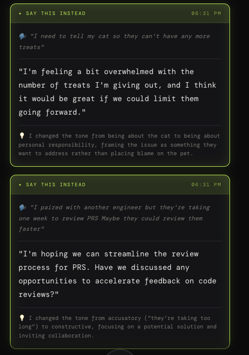

# Reframe

A real-time communication coach that helps you express your thoughts more diplomatically in meetings.



## How It Works

1. Start listening and speak naturally during your meeting
2. When you want to say something unfiltered, say your wake phrase (default: "here's the thing") followed by your real thoughts
3. After a brief pause, Reframe rewrites your statement in a more appropriate tone
4. Deliver the reframed version instead

## Quick Start

1. Open `reframe.html` in a modern browser (Chrome, Edge, or Safari recommended)
2. Click the gear icon to open settings
3. Choose your AI provider and configure it (see below)
4. Click the microphone button and allow microphone access
5. Start talking

## AI Provider Setup

### Anthropic (Claude)

1. Get an API key from [console.anthropic.com](https://console.anthropic.com/)
2. In Reframe settings:
   - **Provider**: Anthropic
   - **API Key**: Your Anthropic API key
   - **Model**: `claude-sonnet-4-20250514` (default) or another Claude model

### OpenAI (GPT)

1. Get an API key from [platform.openai.com](https://platform.openai.com/)
2. In Reframe settings:
   - **Provider**: OpenAI
   - **API Key**: Your OpenAI API key
   - **Model**: `gpt-4o` (default) or another OpenAI model

### Ollama (Local)

Run AI models locally without an API key.

1. Install Ollama from [ollama.com](https://ollama.com/)
2. Pull a model:
   ```bash
   ollama pull llama3.2
   ```
3. Start the Ollama server:
   ```bash
   ollama serve
   ```
4. In Reframe settings:
   - **Provider**: Ollama
   - **Ollama URL**: `http://localhost:11434` (default)
   - **Model**: `llama3.2` (or whichever model you pulled)

## Configuration Options

| Setting | Default | Description |
|---------|---------|-------------|
| Wake Phrase | `here's the thing` | Phrase that triggers reframing |
| Silence Timeout | `3` seconds | How long to wait after speaking before processing |
| Style | `diplomatic` | Tone for reframing |

### Reframing Styles

- **Diplomatic** - Professional and constructive
- **Manager** - Frames in terms of team impact
- **Client-facing** - Extra polished and warm
- **Direct** - Honest but kind

## Running Over HTTPS

The Web Speech API works best over HTTPS. SSL certificates are included for local development:

```bash
# Using Python
python3 -m http.server 8443 --bind 127.0.0.1

# Using Node.js (with a simple HTTPS server)
npx http-server -S -C cert.pem -K key.pem -p 8443
```

Then open `https://localhost:8443/reframe.html`

## Browser Requirements

- Chrome, Edge, or Safari (Web Speech API support required)
- Microphone access permission
- JavaScript enabled

## Privacy

- API keys are stored locally in your browser's localStorage
- No data is sent to any server except your chosen AI provider
- Meeting context and reframed responses stay in your browser

## Troubleshooting

**Microphone not working?**
- Ensure you've granted microphone permission to the page
- Try using HTTPS instead of HTTP
- Check that no other app is using the microphone

**API errors?**
- Verify your API key is correct
- Check that you have credits/quota with your provider
- For Ollama, ensure the server is running (`ollama serve`)

**Speech not recognized?**
- Speak clearly and at a normal pace
- Check your system microphone settings
- Try a different browser (Chrome has the best Web Speech API support)
